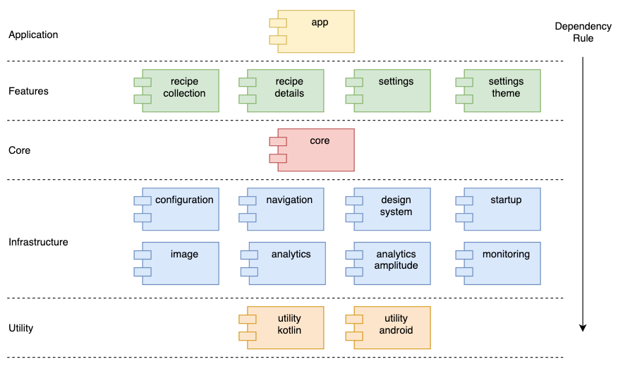

# Recipe Book - My pet project 👷‍

This app provides a small collection of recipes and their details. Also, there is a few possible settings configuration.

This project is intended to be a case that prioritize a scalable architecture, following good design principles, a codebase that could be maintained by a large number of collaborators/teams. Also, some new approaches may be used as a study purpose.

## Table of contents
-   [Tech stack](https://github.com/cmorigaki/recipe-book/#tech-stack)
-   [Architecture](https://github.com/cmorigaki/recipe-book/#architecture)
-   [Modularization](https://github.com/cmorigaki/recipe-book/#modularization)
-   [Code](https://github.com/cmorigaki/recipe-book/#code)
-   [Build Config](https://github.com/cmorigaki/recipe-book/#build-config)
-   [CI/CD](https://github.com/cmorigaki/recipe-book/#cicd)

## Tech stack
- 100% kotlin
- coroutines
- StateFlow (instead of LiveData)
- Jetpack ViewModel
- View binding
- Koin
- Retrofit
- Moshi
- Gradle Groovy
- Github actions

## Architecture
In general, I try to follow SOLID and clean code principles for every piece of code.

### Features
In a feature scope (a screen for this project), the architecture relies on 5 distinct layers: View, Presentation, Domain, Data, Data source. These layers follows a **Clean architecture** dependency that can be represented by the below picture:
<p align="center">
    
</p>

For "view architecture" I'm using MVVM (Jetpack ViewModel), view binding (not DataBinding), kotlin StateFlow instead of LiveData.

### Data flow
Since I'm using 100% kotlin, any asynchronous operation or background work uses kotlin coroutines and Flow when a reactive approach is necessary.
For any SDK integration, I would wrap them using suspendCoroutine/channelFlow to give them a suspend function abstraction over the API calls.

### Navigation
There are some solutions for navigation that have huge impact by modularization.
Today, I have a MainNavigator interface that receives an object that relates to a given screen. The injected list of Navigation resolvers are provided using Koin "multibinding".
<p align="center">
    
</p>

### Theme
The application has dark and light mode that can be changed at runtime. All definitions/styles are inside design-system module.
| Light | Dark |
|---|---|
|  |  |

### DI Framework
Koin

## Modularization
The whole application is composed of several modules that are ruled by a hierarchy dependency structure. All modules are classified into a specific module layer and this layer must respect the dependency direction, this is, a given module can only depend on modules of the same layer or below.

### Modules layers
The picture shows the current modules and how they are structured.
<p align="center">
    
</p>

1. **App** - Glue all modules and it has project configurations like build variants, API keys.
2. **Feature** - Product features are developed at this level of modules. For this project I have modules:screen 1:1 but it may vary a lot.
3. **Core** - Here I have modules that are not tied to a specific feature scope but the entire app like Base Classes when needed (I am pretty confident that I keep this layer really small).
4. **Infrastructure** - Modules that compose the foundation of the project. Here we have networking, monitoring, analytics, design-system, navigation.
4. **Utility** - Helpers and extensions classes goes here. But only the ones that are not related to business of the project and it can be reused by other projects.

## Code

### Code style
//TODO

### Resources naming convention
//TODO

### Classes naming convention
//TODO

## Tooling

### Crash report
//TODO

### Event report
//TODO

## Build Config

### Gradle files

#### ~~Kotlin DSL~~
I tried to use gradle kotlin DSL but I've encountered errors when splitting build files for modules reuse.

#### Sync dependency versions
To synchronize dependency versions and avoid string duplications, I'm using a common file that declares dependency versions as constants referencing them inside build.gradle files. [ref:link]

#### Reuse build.gradle
In general, features modules have a lot of common dependency. Said that, I'm reusing a base build.gradle files whenever is possible.

#### Proguard
Applying obfuscation and shrink code is a must for the release build.

## CI/CD

### Framework
I'm using Github actions for CI. Currently, it's still pretty basic...

### Secrets
//TODO

## Authors

* **Cesar Morigaki**

## License
```
The MIT License (MIT)

Copyright (c) 2020 Cesar Augusto Morigaki

Permission is hereby granted, free of charge, to any person obtaining a copy
of this software and associated documentation files (the "Software"), to deal
in the Software without restriction, including without limitation the rights
to use, copy, modify, merge, publish, distribute, sublicense, and/or sell
copies of the Software, and to permit persons to whom the Software is
furnished to do so, subject to the following conditions:

The above copyright notice and this permission notice shall be included in
all copies or substantial portions of the Software.

THE SOFTWARE IS PROVIDED "AS IS", WITHOUT WARRANTY OF ANY KIND, EXPRESS OR
IMPLIED, INCLUDING BUT NOT LIMITED TO THE WARRANTIES OF MERCHANTABILITY,
FITNESS FOR A PARTICULAR PURPOSE AND NONINFRINGEMENT. IN NO EVENT SHALL THE
AUTHORS OR COPYRIGHT HOLDERS BE LIABLE FOR ANY CLAIM, DAMAGES OR OTHER
LIABILITY, WHETHER IN AN ACTION OF CONTRACT, TORT OR OTHERWISE, ARISING FROM,
OUT OF OR IN CONNECTION WITH THE SOFTWARE OR THE USE OR OTHER DEALINGS IN
THE SOFTWARE.
```
